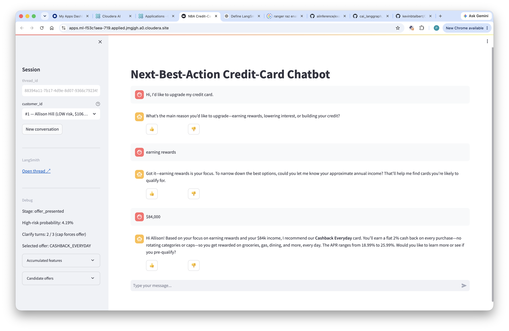
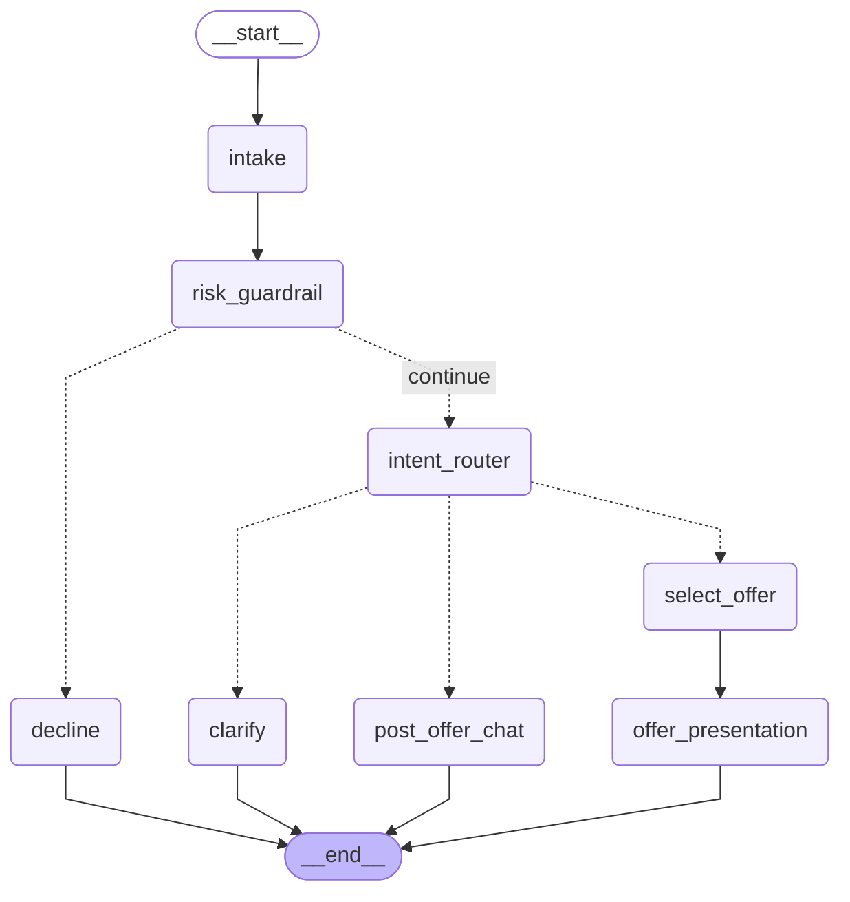

# Cloudera Blueprint: NBA Chatbot — Evaluated, Observed Multi-Agent Apps on Cloudera AI with LangSmith

> A reusable blueprint for building a **Next-Best-Action** credit-card recommender as a **multi-turn chatbot** on **Cloudera AI**, powered by a **LangGraph** multi-agent workflow, guarded by a customer-risk check, and fully instrumented with **LangSmith** for offline evaluation and online monitoring.

## Table of Contents

- [Overview](#overview)
- [Demo](#demo)
- [Use Case](#use-case)
- [Key Features](#key-features)
- [Quickstart / Guide](#quickstart--guide)
- [Architecture / Software Components](#architecture--software-components)
- [Target Audience](#target-audience)
- [Repository Structure](#repository-structure)
- [Prerequisites](#prerequisites)
- [Hardware Requirements](#hardware-requirements)
- [Documentation](#documentation)

## Overview

This blueprint shows how to build, evaluate, and observe a **production-grade multi-agent chatbot** entirely on Cloudera AI. The demo user plays a bank customer: they open a chat, state their reason for contacting, and a **LangGraph** multi-agent system asks clarifying questions until it has enough context to present the best-fit credit-card offer. A customer-risk guardrail short-circuits the workflow into a polite decline for HIGH-risk profiles. Every turn is traced to **LangSmith** with per-thread grouping and thumbs feedback, and three notebooks turn scripted conversations into repeatable **offline evaluations** with deterministic and LLM-as-judge scorers. The stack — Nemotron on **Cloudera AI Inference Service**, LangGraph checkpointer state, Streamlit UI hosted as a **Cloudera AI Application**, and an optional XGBoost/PyTorch ONNX risk classifier — is the reference wiring for any evaluated agentic app on the Cloudera platform.

> **Guardrail status.** The customer-risk guardrail currently runs as a small **rules-based placeholder** in `app/nba_app.py` (`_rules_based_risk_score`) — no model endpoint required. An ML-backed guardrail (XGBoost / PyTorch → ONNX → CAI Inference Service) is scaffolded under `xgboost/` and `pytorch_train/` and can be re-enabled by swapping the call in `risk_guardrail_node`. Steps 2–3 of the Quickstart describe the ML path and are optional while the rules-based guardrail is in use.

## Demo

A representative interaction with the deployed chatbot on Cloudera AI. The customer (Allison Hill, LOW-risk tier, $106K income) asks to upgrade their card. The bot asks two clarifying questions — reason for change, then income — hits the `Clarify turns: 2 / 3` cap, and pitches **Cashback Everyday** (2% cash back, 18.99–25.99% APR). The debug pane on the right shows the graph stage (`offer_presented`), the guardrail's high-risk probability (4.19%), and the selected offer id (`CASHBACK_EVERYDAY`). Thumbs feedback under the reply lands on the correct per-turn `run_id` in LangSmith.



## Use Case

Banks routinely pitch card upgrades and cross-sells to customers via chat, but three requirements block naive LLM chatbots from serving that traffic:

1. **Regulated recommendations.** Every offer presented must be tied to a rule-based eligibility check (risk tier, age, income) — not the LLM's judgment alone.
2. **Fail-safe decline path.** HIGH-risk customers must be routed to a polite decline that quotes no specific product figures and redirects to a human agent.
3. **Auditability.** Product, risk, and compliance teams need to inspect every conversation turn-by-turn, replay them against new prompts, and grade them offline before promoting a model change.

This blueprint implements all three: a **multi-turn LangGraph agent** does the conversational work; a **rule engine** over a SQLite offer catalog picks the concrete offer; a **customer-risk guardrail** short-circuits HIGH-risk customers into `decline`; and **LangSmith** captures traces, groups them into threads, and runs the three offline evaluation notebooks that grade correctness, guardrail behavior, offer relevance, and conversation quality on scripted golden conversations. The business outcome is a conversational NBA channel that a compliance team can approve.

## Key Features

- **Multi-turn LangGraph MAS.** `intake → risk_guardrail → intent_router → {clarify | select_offer → offer_presentation | post_offer_chat | decline}` with `MemorySaver` checkpointer keyed on `thread_id`. Hard cap of 3 clarifying questions before an offer is forced.
- **Customer-risk guardrail** with a rules-based placeholder today and drop-in ONNX endpoints (XGBoost or PyTorch) already scaffolded.
- **Rule-engine offer selection** over 5 seeded offers stored in SQLite (`nba_demo.db`) — SQL eligibility filter + Python re-scoring by stated goal.
- **LangSmith tracing on every turn**: root run per `run_turn(...)` with nested runs for each node, tagged with `thread_id` metadata so LangSmith's **Threads** tab groups them into one conversation.
- **👍/👎 feedback** below every assistant reply, written to the correct per-turn `run_id`.
- **Offline evaluations** (3 notebooks) with deterministic scorers (`correct_offer_selection`, `guardrail_correctness`) and LLM-as-judge scorers (`offer_relevance_llm_judge`, `conversation_quality_llm_judge`) — Nemotron via structured output.
- **Comparable experiments side-by-side**: temperature sweeps, per-split runs, `num_repetitions` for stability — all as `client.evaluate(...)` calls on the same golden dataset.
- **Cloudera-native deployment.** Streamlit app hosted as a **Cloudera AI Application**; LLM served by **Cloudera AI Inference Service**; optional ONNX risk classifier served by **CAI Inference** as well.

## Quickstart / Guide

Follow these steps in order the first time you set up the demo. Each step depends on the previous one.

### Step 1 — Seed the SQLite database with synthetic customers

From a CAI workbench terminal at the project root, run:

```bash
python app/pii_datagen.py --rows 10000
```

This creates `nba_demo.db` at the project root and populates it with:

- the fixed offer catalog (5 offers seeded by `app/db.py`);
- 10,000 synthetic customer PII rows generated by Faker — `age`, `annual_income`, `employment_status`, `existing_debt`, and `risk_tier` are the columns the classifier and rule engine key off.

The command is idempotent: `--ensure` skips re-seeding if the table already has enough rows. All downstream steps (training, deployment smoke test, the app itself) read from this same SQLite file.

### Step 2 — (Optional) Train an ML-backed customer-risk classifier

**Skip this if you're happy with the rules-based guardrail.** The app runs end-to-end without a trained model.

If you want to enable the ML path, open **`xgboost/01_train_xgboost_onnx.ipynb`** in a CAI workbench session and run all cells. This will:

- re-verify `nba_demo.db` is seeded (a no-op if Step 1 ran successfully);
- train a binary XGBoost classifier on 8 customer-profile features (`age`, `annual_income`, `existing_debt`, plus one-hot `emp_*` employment status) with label `is_high_risk = (risk_tier == 'HIGH')`;
- log the run to an MLflow experiment named `nba-customer-risk-<PROJECT_OWNER>`;
- register the ONNX model in the **CAI AI Registry** as **`nba-risk-onnx-xgboost`**.

> **Alternative — PyTorch classifier.** If the XGBoost/ONNX conversion path is broken in your CAI environment, `pytorch_train/01_train_pytorch_onnx.ipynb` + `pytorch_train/02_deploy_pytorch_ai_inf.ipynb` train and deploy the equivalent 8-feature customer-risk model as a small PyTorch net exported to ONNX. It registers as `nba-risk-onnx-pytorch` and serves the same `(label, probabilities)` response shape as the XGBoost endpoint.

### Step 3 — (Optional) Deploy the classifier to CAI Inference Service

**Skip if you skipped Step 2.**

Open **`xgboost/02_deploy_xgboost_ai_inf.ipynb`** and run all cells. This will:

- look up the newest registered version of `nba-risk-onnx-xgboost`;
- create (or update) a CAI Inference endpoint named **`nba-risk-endpoint`**;
- run a smoke-test inference call against the deployed endpoint using rows sampled from the SQLite `customers` table.

Note the endpoint's base URL and CDP token — you'll need them for `CLF_ENDPOINT_BASE_URL` and `CLF_CDP_TOKEN` if/when you wire the ML guardrail back into `app/nba_app.py`. See **Re-enabling the ML guardrail** below.

### Step 4 — Run the offline LangSmith evaluations

With `LANGSMITH_API_KEY`, `LANGSMITH_PROJECT`, and the LLM/XGBoost endpoint env vars set, run these notebooks **in order** from the repo root:

1. **`nba_dataset_upload.ipynb`** — creates the `NBA Golden Dataset` in LangSmith (~14 scripted multi-turn conversations, labeled by `split`).
2. **`nba_evaluators.ipynb`** — defines the 4 evaluators (`correct_offer_selection`, `guardrail_correctness`, `offer_relevance_llm_judge`, `conversation_quality_llm_judge`).
3. **`nba_experiments.ipynb`** — replays every scripted conversation turn-by-turn against the compiled LangGraph (importing `run_turn` from `app/nba_app.py`) and grades the final state. Runs several experiments side-by-side so you can compare temperature and split cuts.

Acceptance targets at temperature 0.2: `correct_offer >= 0.7`, `guardrail_correct == 1.0`, `offer_relevance >= 7/10`.

### Step 5 — Deploy the chatbot and try it live

Launch the Streamlit app as a Cloudera AI Application pointing at **`launch_app.py`** (which boots `app/nba_app.py`).

**Pick a customer from the sidebar dropdown** before you start typing. The dropdown is populated at app start from the seeded SQLite `customers` table and covers all three risk tiers (two customers each) — LOW → MED → HIGH. Every entry shows the customer name, risk tier, and annual income so you can see up-front which path the graph will take.

Two paths to try:

| Pick a customer in tier… | What the graph does |
|---|---|
| **LOW** or **MED** | `intake → risk_guardrail → intent_router → clarify → select_offer → offer_presentation`. The bot pitches the best-fit offer from the rule engine (Platinum Travel, Cashback Everyday, Student Starter, …). |
| **HIGH** | `intake → risk_guardrail → decline`. `_rules_based_risk_score` clears `HIGH_RISK_THRESHOLD` (0.5 by default) and the bot politely declines and redirects to support. |

Scripted turns to send once you've picked a customer:

- **Card upgrade** → *"Hi, I'd like to upgrade my credit card."* → follow the clarifying prompts (income, goal). The bot pitches the best-fit offer.
- **Post-offer follow-up** → *"What's the annual fee?"* — routes to `post_offer_chat` using the offer already in state.
- **New conversation** → click **"New conversation"** in the sidebar to start a fresh `thread_id` (the customer stays selected).

Every turn is a `run_turn(...)` invocation tagged with `thread_id` metadata, so each conversation shows up as a single thread in LangSmith. The Demo screenshot above is the reference for what a successful "LOW-risk customer, 3-turn conversation ending in an offer" run looks like.

### Step 6 — Inspect traces in the LangSmith UI

Open your LangSmith project and:

- Look at **Runs** — each turn is one root run with nested runs for `intake`, `risk_guardrail`, `intent_router`, `offer_selection`, etc.
- Open the **Threads** tab and find the `thread_id`s produced by your chat session — every turn from the same conversation is grouped there.
- Click through to a run and confirm the 👍/👎 feedback buttons you clicked in the app show up as feedback on the correct per-turn `run_id`.
- Compare the offline experiment runs from Step 4 side-by-side under the **Experiments** tab of the `NBA Golden Dataset`.

## Architecture / Software Components

The demo is composed of five Cloudera / third-party components:

- **LangGraph MAS** — a `StateGraph` compiled with `MemorySaver` checkpointer keyed on `thread_id`. All nodes are `@traceable`, and the whole per-turn invocation is wrapped by `run_turn(...)` which becomes the LangSmith root run for that turn.
- **Cloudera AI Inference Service — Nemotron LLM endpoint** — powers every LLM step (feature extraction, intent routing, clarifying questions, offer pitches, decline text, and both LLM-as-judge evaluators). OpenAI-compatible.
- **Cloudera AI Inference Service — ONNX classifier endpoint (optional)** — hosts the customer-risk XGBoost or PyTorch model when the ML guardrail is enabled.
- **SQLite (`nba_demo.db`)** — offer catalog + synthetic customer PII table. Reachable from both the app and the notebooks because it lives at repo root.
- **LangSmith** — trace collection, thread grouping, thumbs feedback storage, offline experiments (`client.evaluate(...)`), and optional online evaluators attached in the UI.

### Runtime data flow

```
                                           ┌──────────────────┐
                     ┌──────────────────►  │  CAI Nemotron    │  (feature-extract,
                     │                     │  LLM endpoint    │   route, clarify,
                     │                     └──────────────────┘   pitch, judge)
                     │
   user turn ──►  intake ──► risk_guardrail ──(low)──► intent_router ─┬──► clarify ──► END
   (Streamlit)                     │                                   ├──► offer_selection ──► offer_presentation ──► END
                                   │                                   └──► post_offer_chat ──► END
                                   └──(high)──► decline ──► END
                                          │
                                          ▼
                                   ┌────────────────────────┐
                                   │  Rules-based risk      │  (risk_tier, DTI,
                                   │  scorer (in-process)   │   unemployment checks)
                                   └────────────────────────┘
                                          │
                                          │  (swap in for ML path — see
                                          │   "Re-enabling the ML guardrail")
                                          ▼
                                   ┌──────────────────┐
                                   │  CAI XGBoost /   │  (high-risk probability)
                                   │  PyTorch endpoint│
                                   └──────────────────┘

   State (LangGraph MemorySaver, keyed on thread_id):
     messages, accumulated_features, customer_record, high_risk_probability,
     selected_offer, conversation_stage
```

### MAS workflow (graph)

Each user turn re-enters the graph at `intake` and follows one of four paths to `END`: **decline** (guardrail fired), **clarify** (need more info), **offer_presentation** (via `select_offer`), or **post_offer_chat** (offer already on the table, customer is asking follow-ups). Solid arrows are unconditional transitions; dashed arrows are conditional routes emitted by the two routers (`risk_router` after the guardrail, `stage_router` after the intent router).



### What each node does

| Node | Role | Reads from state | Writes to state |
|---|---|---|---|
| `intake` | Merges the newest user turn into the accumulated feature set via a Nemotron structured-output prompt (`method="json_mode"`), and lazily loads the customer PII row from SQLite on first turn. | `messages`, `customer_id`, `accumulated_features` | `accumulated_features`, `customer_record` |
| `risk_guardrail` | Runs `_rules_based_risk_score(customer_record)` — the current placeholder scorer covering `risk_tier == HIGH`, DTI > 0.6, and unemployed-with-debt. Sets `risk_blocked` when the score crosses `HIGH_RISK_THRESHOLD`. Swap in an ML endpoint call here to re-enable the classifier path. | `customer_record` | `high_risk_probability`, `risk_blocked` |
| `intent_router` | Nemotron classifier that decides the next hop: `NEED_MORE_INFO` → clarify, `READY_FOR_OFFER` → select_offer, `POST_OFFER_CHAT` → post_offer_chat. Reads the full transcript, accumulated features, and whether an `[OFFER PRESENTED: …]` marker is already in the messages. | `messages`, `accumulated_features`, `selected_offer` | `conversation_stage`, `_next_stage` |
| `clarify` | Nemotron prompt that asks one short, specific clarifying question, without re-asking a field already populated. | `messages`, `accumulated_features` | `messages` (appends `AIMessage`) |
| `select_offer` | SQL + Python rule engine (`app/offer_rules.py`) over the 5-offer catalog. Filters by customer eligibility (risk tier, age, income) then re-scores by stated goal + feature match. Returns top-3 candidates; the highest becomes `selected_offer`. | `customer_record`, `accumulated_features` | `selected_offer`, `candidate_offers` |
| `offer_presentation` | Nemotron pitches the chosen offer conversationally (under 120 words, prefixed with `[OFFER PRESENTED: <offer_id>]` so downstream turns detect an offer has been made). | `selected_offer`, `customer_record`, `accumulated_features`, `messages` | `messages`, `conversation_stage = "offer_presented"` |
| `post_offer_chat` | Nemotron answers follow-up questions grounded on the offer JSON already in state. Refuses to invent facts it doesn't have. | `selected_offer`, `messages` | `messages`, `conversation_stage = "post_offer"` |
| `decline` | Nemotron writes a short, warm decline that redirects the customer to support without quoting any specific figures. Terminal node. | `messages` | `messages`, `risk_blocked = True` |

### Regenerating the diagram

The Mermaid source is exported straight from the compiled `StateGraph` — no risk of drift:

```
NBA_MOCK=1 python scripts/export_graph_mermaid.py
```

That writes `img/nba_graph.mmd` and prints the same Mermaid text you see in the fenced block above. When you add or rewire a node in `app/nba_app.py:_build_graph`, re-run the script and paste the updated block back in here.

## Target Audience

- **Solution architects & SEs** — reference wiring for an evaluated, observed agentic app on Cloudera AI they can adapt to a customer's own dataset.
- **ML / GenAI engineers** — end-to-end template for combining LangGraph state machines with LangSmith evaluators (deterministic + LLM-as-judge) and ONNX-served classifiers on CAI Inference.
- **Compliance / risk stakeholders** — a working example of a **guarded** GenAI recommendation flow with an inspectable decline path and per-turn trace evidence.
- **Product managers piloting conversational NBA** — a starting point for user studies on multi-turn recommendation UX before committing to a heavy production build.

## Repository Structure

| Path | Description |
|---|---|
| `app/nba_app.py` | LangGraph chatbot + Streamlit UI. Hosts `_rules_based_risk_score`, the current placeholder guardrail. |
| `app/db.py` | SQLite schema + offer seeding (DB file `nba_demo.db` sits at the project root so both the app and the notebooks can reach it). |
| `app/offer_rules.py` | Rule-engine (SQL filter + Python re-scoring). |
| `app/pii_datagen.py` | Faker-based customer seeder (`--ensure`, `--rows`). |
| `launch_app.py` | Cloudera AI Application entry point (stays at repo root so CAI's Application `Script` field is `launch_app.py`). |
| `scripts/export_graph_mermaid.py` | Regenerates the MAS Mermaid diagram from the compiled `StateGraph`. |
| `xgboost/01_train_xgboost_onnx.ipynb` | **Optional (ML guardrail path).** Trains the customer-risk XGBoost classifier off SQLite and registers it as `nba-risk-onnx-xgboost`. |
| `xgboost/02_deploy_xgboost_ai_inf.ipynb` | **Optional (ML guardrail path).** Deploys the registered model to the `nba-risk-endpoint` CAI Inference endpoint + smoke-tests it. |
| `pytorch_train/01_train_pytorch_onnx.ipynb` | **Optional (ML guardrail path).** Alternative to XGBoost — trains an 8-feature PyTorch NN, exports to ONNX, and registers as `nba-risk-onnx-pytorch` (+ raw PyTorch model as `nba-risk-pytorch`). |
| `pytorch_train/02_deploy_pytorch_ai_inf.ipynb` | **Optional (ML guardrail path).** Deploys `nba-risk-onnx-pytorch` to the `nba-risk-pytorch-endpoint` CAI Inference endpoint + smoke-tests it. |
| `nba_dataset_upload.ipynb` | Uploads scripted multi-turn examples to LangSmith as `NBA Golden Dataset`. |
| `nba_evaluators.ipynb` | 4 evaluators (2 deterministic, 2 LLM-as-judge). |
| `nba_experiments.ipynb` | `evaluate()` calls with the replay target function; runs the side-by-side experiments. |
| `img/` | Diagrams and screenshots (including the Demo screenshot above and `nba_graph.mmd`). |
| `.env.example` | Env-var template. |
| `METADATA.yaml` | Catalog metadata for the Cloudera blueprint website. |
| `utils.py`, `tracing_basics.ipynb`, `dataset_upload.ipynb`, `evaluators.ipynb`, `experiments.ipynb`, `types_of_runs.ipynb`, `conversational_threads.ipynb` | Reference material from the LangSmith course, unmodified. |

## Prerequisites

**Cloudera platform**

- A **Cloudera AI Workbench** project with terminal + notebook access.
- A **Cloudera AI Inference Service** entitlement, with a **Nemotron** (or any OpenAI-compatible) LLM endpoint provisioned. Note the base URL and CDP token.
- (Optional, ML guardrail path only) An **AI Registry** and the ability to deploy an ONNX endpoint on CAI Inference.

**External services**

- A **LangSmith** account and API key (organization/project set up).

**Tooling**

- Python 3.10+ (already provided by CAI runtimes).
- `git`.
- Python packages from `requirements.txt` (installed inside the CAI session).

**Configuration.** Copy `.env.example` to `.env` and fill in:

| Var | Purpose |
|---|---|
| `LLM_MODEL_ID` | Nemotron model ID on CAI Inference (default `nemotron`) |
| `LLM_ENDPOINT_BASE_URL` | Nemotron OpenAI-compatible base URL (`.../openai/v1`) |
| `LLM_CDP_TOKEN` | CDP token for the LLM endpoint |
| `CLF_MODEL_ID` | Unused while the rules-based guardrail is in place. Reserved for when the ML guardrail is re-enabled (default `nba-risk-onnx-xgboost`). |
| `CLF_ENDPOINT_BASE_URL` | Unused while the rules-based guardrail is in place. XGBoost/PyTorch KServe endpoint (no `/openai/v1` suffix) when re-enabled. |
| `CLF_CDP_TOKEN` | Unused while the rules-based guardrail is in place. CDP token for the classifier endpoint when re-enabled. |
| `HIGH_RISK_THRESHOLD` | Decision threshold for the customer-risk guardrail (default `0.5`). Applied to both the rules-based score and any future ML score. `FRAUD_THRESHOLD` is still accepted as a backwards-compat alias. |
| `NBA_DB_PATH` | SQLite file (default: `nba_demo.db` at the project root) |
| `NBA_CUSTOMER_ROWS` | Number of synthetic customers to seed (default `10000`) |
| `NBA_MOCK` | Set to `1` for a local run without live CAI endpoints |
| `LANGSMITH_TRACING` | `true` to enable tracing (default `true`) |
| `LANGSMITH_API_KEY` | LangSmith API key |
| `LANGSMITH_PROJECT` | Project name (default `nba-demo`) |
| `LANGSMITH_ORG` | Org slug/uuid — only used to render "open in LangSmith" links |
| `PROJECT_OWNER` | Free-form owner tag stamped into trace metadata |

### Running on Cloudera AI

1. **Create a project** from this repo. Provision the Nemotron LLM endpoint if you don't already have one; if you want the ML guardrail path, also run **Steps 2–3** from the Quickstart to train and deploy the `nba-risk-endpoint` classifier. Note both endpoints' base URLs + tokens.
2. **Set env vars** on the Application (or in a session's project env vars) — everything from the table above.
3. **Launch as an Application** pointing at `launch_app.py`. On boot it will:
   - run `python /home/cdsw/app/pii_datagen.py --ensure` to create `nba_demo.db` at the project root and seed offers + customers (idempotent — no-op on restart);
   - then `streamlit run /home/cdsw/app/nba_app.py --server.port $CDSW_READONLY_PORT --server.address 127.0.0.1`.
4. **Open the app URL** and chat.

## Hardware Requirements

| Deployment | Minimum |
|---|---|
| Launchable / demo (rules-based guardrail) | 2 vCPU, 8 GB RAM, 5 GB storage for the CAI Application + workbench session. All LLM inference happens on the remote CAI Inference endpoint. |
| ML guardrail path (add XGBoost or PyTorch training + endpoint) | Additional 2 vCPU, 8 GB RAM for the training notebook; CAI Inference endpoint for the ONNX classifier (a single small CPU instance is sufficient). |
| Production / enterprise | Size the CAI Application per expected concurrent chat sessions (each session holds one LangGraph checkpointer thread in memory). LLM and classifier endpoints scale independently on CAI Inference. |

The Nemotron LLM endpoint's sizing is orthogonal and depends entirely on your CAI Inference deployment (typically GPU-backed).

## Documentation

### Offline evaluation — details

Three notebooks, run in order:

1. **`nba_dataset_upload.ipynb`** — creates dataset `NBA Golden Dataset` in LangSmith with ~14 scripted multi-turn conversations, each labeled with a `split` (`travel`, `balance-transfer`, `secured`, `student`, `cashback`, `risk-decline`).
2. **`nba_evaluators.ipynb`** — defines 4 evaluators:
   - `correct_offer_selection` (deterministic — matches `expected_offer_id`)
   - `guardrail_correctness` (deterministic — did the risk guardrail fire iff expected)
   - `offer_relevance_llm_judge` (Nemotron judge, pydantic `Relevance(score, reasoning)`)
   - `conversation_quality_llm_judge` (Nemotron judge on transcript + `turn_count_to_offer`)
3. **`nba_experiments.ipynb`** — the target function **replays each scripted conversation turn-by-turn** against the compiled graph (fresh `thread_id` per example, one `run_turn` per user turn), then LangSmith's `evaluate()` grades the final state. Runs several experiments side-by-side:
   - `nba-baseline-t0.2` — reference metrics at temperature 0.2
   - `nba-hi-temp-0.7` — temperature 0.7 with `num_repetitions=3` for stability
   - `nba-risk-split` — decline path only
   - `nba-student-split` — student split only

### Online monitoring — details

Inside the running Streamlit app:

- **Traces.** Every `run_turn` is a root run in the `LANGSMITH_PROJECT` project. Nodes are nested runs — you can drill into `intake`, `risk_guardrail`, `xgboost_infer`, `intent_router`, and so on for each turn.
- **Threads.** LangSmith's Threads tab groups every turn sharing the same `thread_id` metadata into one conversation view. The sidebar in the app renders a direct link to the current thread.
- **Feedback.** 👍/👎 buttons below every assistant reply call `Client().create_feedback(run_id, key="user_thumbs", score=1|0)`. Because `run_id` is the per-turn root, feedback attaches to the specific turn, not the whole thread.
- **Optional online evaluators.** In LangSmith UI → project settings → *Auto-evaluators*, attach `offer_relevance_llm_judge` (or a toxicity check) to run on a sample of production traces. UI-configured, no code changes required.

Alert patterns to configure in LangSmith: drop in `offer_relevance` mean, spike in `guardrail_correct == 0` false positives, or a spike in 👎 feedback.

### Extending

- **Add a new offer.** Edit `_OFFERS` in `app/db.py`, re-run `python app/pii_datagen.py --ensure`. Rule engine picks it up automatically.
- **Add a new evaluator.** Drop a `def my_eval(inputs, outputs, reference_outputs) -> {"key":..., "score":..., "comment":...}` into `nba_evaluators.ipynb` and add it to the `EVALUATORS` list in `nba_experiments.ipynb`.
- **Swap the LLM.** Change `LLM_MODEL_ID` + `LLM_ENDPOINT_BASE_URL` — everything is OpenAI-compatible through `langchain-openai`.
- **Persistent thread state across app restarts.** Swap `MemorySaver` for `SqliteSaver('nba_demo.db')` in `app/nba_app.py:_build_graph`.

### Re-enabling the ML guardrail

The rules-based `_rules_based_risk_score` in `app/nba_app.py` is a placeholder. To swap in the ML-backed guardrail:

1. Run Steps 2 and 3 (XGBoost path) or their PyTorch equivalents to train and deploy an endpoint.
2. Set `CLF_MODEL_ID`, `CLF_ENDPOINT_BASE_URL`, and `CLF_CDP_TOKEN`.
3. In `risk_guardrail_node`, replace the `_rules_based_risk_score(customer)` call with an inference call to the endpoint. The historical XGBoost inference function (`_xgboost_infer`) lives in the git history — restoring it plus re-adding the `httpx` / `open_inference` imports and rebuilding the feature vector from `FEATURE_ORDER` (still defined in `app/nba_app.py`) is enough to switch back.
4. The output contract (`high_risk_probability`, `risk_blocked`) is unchanged, so nothing downstream needs updating.

### Blueprint enhancement ideas

- Replace SQLite customer info table for XGBoost model training with a **Hive** customer table.
- Replace SQLite customer info table for in-interaction lookups with **OpDB** customer / PII table.
- Enrich customer info schema from simple table to a customer database for more complex PII-based reasoning.
- Deploy the app on **Cloudera AI Inference Service** rather than the workbench.
- Augment reasoning capabilities with dynamic pricing or advanced price-modeling capabilities consumed by the MAS.
- Automate deployment via the **AMP** mechanism.

### External documentation

- [Cloudera AI Inference Service documentation](https://docs.cloudera.com/machine-learning/cloud/ai-inference/index.html)
- [LangGraph documentation](https://langchain-ai.github.io/langgraph/)
- [LangSmith documentation](https://docs.smith.langchain.com/)
